<h1>CI/CD Lab</h1>

<h2>Table of contents</h2>

1. **[Setup gerrit](#setup-gerrit)**. 

2. **[Setup docker runtime](#setup-docker-runtime)**

3. **[Setup jenkins](#setup-jenkins)**

4. **[Setup gerrit and jenkins integration](#setup-gerrit-and-jenkins-integration)**

5. **[Setup the code repository](#setup-the-code-repository)**

6. **[Setup CI job to verify the patch set](#setup-ci-job-to-verify-the-patch-set)**

7. **[Setup CD job to build and publish docker image](#setup-cd-job-to-build-and-publish-docker-image)**

8. **[Setup CD job to deploy the services](#setup-cd-job-to-deploy-the-services)**

<h3>Setup gerrit</h3>

<h5>update systemand install pre-requisites</h5>

~~~bash
ubuntu@cicd-lab:~$ sudo apt-get -y update
ubuntu@cicd-lab:~$ sudo apt-get install git default-jdk wget -y
~~~

<h5>create gerrit user</h5>

~~~bash
ubuntu@cicd-lab:~$ sudo useradd -m gerrit

ubuntu@cicd-lab:~$ sudo su gerrit

gerrit@cicd-lab:/home/ubuntu$ cd

gerrit@cicd-lab:~$ pwd
/home/gerrit

~~~

<h5>download gerrit war file and verify java install</h5>

~~~bash
gerrit@cicd-lab:~$ wget https://www.gerritcodereview.com/download/gerrit-2.12.8.war -O gerrit.war

gerrit@cicd-lab:~$ java -version
openjdk version "1.8.0_171"
OpenJDK Runtime Environment (build 1.8.0_171-8u171-b11-0ubuntu0.16.04.1-b11)
OpenJDK 64-Bit Server VM (build 25.171-b11, mixed mode)
~~~

<h5>Initialize gerrit code review site</h5>

~~~bash
gerrit@cicd-lab:~$ java -jar gerrit.war init -d review_site

*** Gerrit Code Review 2.12.8
*** 

Create '/home/gerrit/review_site' [Y/n]? Y

*** Git Repositories
*** 

Location of Git repositories   [git]:

*** SQL Database
*** 

Database server type           [h2]: 

*** Index
*** 

Type                           [LUCENE/?]:

*** User Authentication
*** 

Authentication method          [OPENID/?]: 
Enable signed push support     [y/N]?

*** Review Labels
*** 

Install Verified label         [y/N]? y

*** Email Delivery
*** 

SMTP server hostname           [localhost]: 
SMTP server port               [(default)]: 
SMTP encryption                [NONE/?]: 
SMTP username                  : 

*** Container Process
*** 

Run as                         [gerrit]: 
Java runtime                   [/usr/lib/jvm/java-8-openjdk-amd64/jre]: 
Copy gerrit.war to review_site/bin/gerrit.war [Y/n]? 
Copying gerrit.war to review_site/bin/gerrit.war

*** SSH Daemon
*** 

Listen on address              [*]: 
Listen on port                 [29418]: 

Gerrit Code Review is not shipped with Bouncy Castle Crypto SSL v152
  If available, Gerrit can take advantage of features
  in the library, but will also function without it.
Download and install it now [Y/n]? n
Generating SSH host key ... rsa(simple)... done

*** HTTP Daemon
*** 

Behind reverse proxy           [y/N]? 
Use SSL (https://)             [y/N]? 
Listen on address              [*]: 
Listen on port                 [8080]: 
Canonical URL                  [http://localhost:8080/]: http://172.16.101.23:8080/

*** Plugins
*** 

Installing plugins.
Install plugin reviewnotes version v2.12.8 [y/N]? y
Install plugin replication version v2.12.8 [y/N]? y
Install plugin commit-message-length-validator version v2.12.8 [y/N]? y
Install plugin download-commands version v2.12.8 [y/N]? y
Install plugin singleusergroup version v2.12.8 [y/N]? y
Initializing plugins.
No plugins found with init steps.

Initialized /home/gerrit/review_site
Executing /home/gerrit/review_site/bin/gerrit.sh start
Starting Gerrit Code Review: OK
Waiting for server on 172.16.101.23:8080 ... OK
Opening http://172.16.101.23:8080/#/admin/projects/ ...FAILED
Open Gerrit with a JavaScript capable browser:
  http://172.16.101.23:8080/#/admin/projects/

~~~

<h5>Register initial admin user</h5>

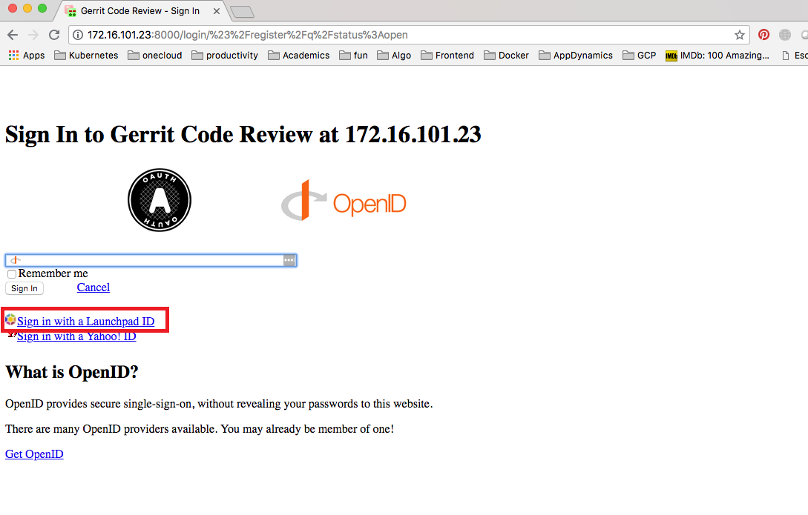

<h3>Setup docker runtime</h3>

<h5>Install pre-requisites</h5>

~~~bash
ubuntu@cicd-lab:~$ sudo apt-get install \
    apt-transport-https \
    ca-certificates \
    curl \
    software-properties-common
~~~

<h5>add docker apt repository</h5>

~~~bash
ubuntu@cicd-lab:~$ curl -fsSL https://download.docker.com/linux/ubuntu/gpg | sudo apt-key add -
OK

ubuntu@cicd-lab:~$ sudo apt-key fingerprint 0EBFCD88
pub   4096R/0EBFCD88 2017-02-22
      Key fingerprint = 9DC8 5822 9FC7 DD38 854A  E2D8 8D81 803C 0EBF CD88
uid                  Docker Release (CE deb) <docker@docker.com>
sub   4096R/F273FCD8 2017-02-22

ubuntu@cicd-lab:~$ sudo add-apt-repository \
   "deb [arch=amd64] https://download.docker.com/linux/ubuntu \
   $(lsb_release -cs) \
   stable”

~~~

<h5>Install docker-ce</h5>

~~~bash
ubuntu@cicd-lab:~$ sudo apt-get update

ubuntu@cicd-lab:~$ sudo apt-get install docker-ce

ubuntu@cicd-lab:~$ sudo systemctl status docker.service
● docker.service - Docker Application Container Engine
   Loaded: loaded (/lib/systemd/system/docker.service; enabled; vendor preset: enabled)
   Active: active (running) since Wed 2018-07-18 06:15:45 UTC; 38s ago

~~~

<h5>Add user to docker group to enable access</h5>

~~~bash
ubuntu@cicd-lab:~$ sudo usermod -aG docker ubuntu
~~~

<h5>Secure the docker daemon with TLS to enable remote access</h5>

**Create directories to hold the certificates**

~~~bash
ubuntu@cicd-lab:~$ sudo mkdir /etc/docker/ssl
ubuntu@cicd-lab:~$ mkdir -p ~/.docker
~~~

**CREATE AND SIGN CA key and certificate**

~~~bash
ubuntu@cicd-lab:~$ openssl genrsa -out ~/.docker/ca-key.pem 2048

ubuntu@cicd-lab:~$ openssl req -x509 -new -nodes -key ~/.docker/ca-key.pem \
    -days 10000 -out ~/.docker/ca.pem -subj '/CN=docker-CA'

ubuntu@cicd-lab:~$ ls ~/.docker/
ca-key.pem  ca.pem

ubuntu@cicd-lab:~$ sudo cp ~/.docker/ca.pem /etc/docker/ssl
~~~

**Create openssl config for client certificate**

~~~bash
ubuntu@cicd-lab:~$ vim ~/.docker/openssl.cnf
~~~

and copy the following content into that and save the file

~~~bash
[req]
req_extensions = v3_req
distinguished_name = req_distinguished_name
[req_distinguished_name]
[ v3_req ]
basicConstraints = CA:FALSE
keyUsage = nonRepudiation, digitalSignature, keyEncipherment
extendedKeyUsage = serverAuth, clientAuth
~~~

**Create openssl config for server certificate**

~~~bash
ubuntu@cicd-lab:~$ sudo vim /etc/docker/ssl/openssl.cnf
~~~

and copy the following content into that and save the file

~~~bash
[req]
req_extensions = v3_req
distinguished_name = req_distinguished_name
[req_distinguished_name]
[ v3_req ]
basicConstraints = CA:FALSE
keyUsage = nonRepudiation, digitalSignature, keyEncipherment
extendedKeyUsage = serverAuth, clientAuth
subjectAltName = @alt_names

[alt_names]
DNS.1 = cicd-lab.nova.local
IP.1 = 172.16.101.23
IP.2 = 127.0.0.1
~~~

*`make sure the IP.1 is the ip of your vm`*

**Create and sign client certificate**

~~~bash
ubuntu@cicd-lab:~$ openssl genrsa -out ~/.docker/key.pem 2048

ubuntu@cicd-lab:~$ openssl req -new -key ~/.docker/key.pem -out ~/.docker/cert.csr \
    -subj '/CN=docker-client' -config ~/.docker/openssl.cnf

ubuntu@cicd-lab:~$ openssl x509 -req -in ~/.docker/cert.csr -CA ~/.docker/ca.pem \
    -CAkey ~/.docker/ca-key.pem -CAcreateserial \
    -out ~/.docker/cert.pem -days 365 -extensions v3_req \
    -extfile ~/.docker/openssl.cnf
~~~

**Create and sign server certificate**

~~~bash
ubuntu@cicd-lab:~$ sudo openssl genrsa -out /etc/docker/ssl/key.pem 2048

ubuntu@cicd-lab:~$ sudo openssl req -new -key /etc/docker/ssl/key.pem \
    -out /etc/docker/ssl/cert.csr \
    -subj '/CN=docker-server' -config /etc/docker/ssl/openssl.cnf

ubuntu@cicd-lab:~$ sudo openssl x509 -req -in /etc/docker/ssl/cert.csr -CA ~/.docker/ca.pem \
    -CAkey ~/.docker/ca-key.pem -CAcreateserial \
    -out /etc/docker/ssl/cert.pem -days 365 -extensions v3_req \
    -extfile /etc/docker/ssl/openssl.cnf
~~~

**Create docker daemon config and update docker systemd unit file**

~~~bash
ubuntu@cicd-lab:~$ sudo vim /etc/docker/daemon.json
~~~

and copy the following content into that and save the file

~~~bash
{
        "tls": true,
        "tlsverify": true,
        "tlscacert": "/etc/docker/ssl/ca.pem",
        "tlscert": "/etc/docker/ssl/cert.pem",
        "tlskey": "/etc/docker/ssl/key.pem"
}
~~~

Edit the docker systemd unit file to update the host entry

~~~bash
ubuntu@cicd-lab:~$ sudo vim /lib/systemd/system/docker.service
~~~

and edit the ExecStart value under the service section to look as following:

~~~bash
ExecStart=/usr/bin/dockerd -H unix:///var/run/docker.sock -H tcp://0.0.0.0:2376
~~~

reload the docker daemon and restart the docker service as follows:

~~~bash
ubuntu@cicd-lab:~$ sudo systemctl daemon-reload
ubuntu@cicd-lab:~$ sudo service docker stop
ubuntu@cicd-lab:~$ sudo service docker start
~~~

<h3>Setup Jenkins</h3>

<h5>running jenkins as a container</h5>

*We can run Jenkins as a container for this lab. Since, Jenkins will running as a container we should also do some extra steps to expose the docker daemon on the host so Jenkins can run docker commands to build and push images to registry. We also need a docker client to connect to docker remote API on the docker host where we will deploy our services(in this case it will be the same host)*

~~~bash
ubuntu@cicd-lab:~$ docker run -p 8080:8080 -p 50000:50000 \
-d -v /var/run/docker.sock:/var/run/docker.sock \
—name jenkins jenkins/jenkins:lts
~~~

<h5>Install docker inside jenkins container</h5>

~~~bash
ubuntu@cicd-lab:~$ docker exec -it -u root jenkins bash

root@5a2f3d6d9005:~# apt-get update && apt-get -y install \
apt-transport-https ca-certificates curl gnupg2 \
software-properties-common

root@5a2f3d6d9005:~# curl -fsSL https://download.docker.com/linux/$(. /etc/os-release; echo "$ID")/gpg > /tmp/dkey; apt-key add /tmp/dkey

root@5a2f3d6d9005:~# add-apt-repository \
   "deb [arch=amd64] https://download.docker.com/linux/$(. /etc/os-release; echo "$ID") \
   $(lsb_release -cs) \
   stable"

root@5a2f3d6d9005:~# apt-get update && \
apt-get -y install docker-ce
~~~

<h5>Login to the jenkins UI and complete the setup</h5>

get the initialAdminPassword from the running container as follows:

~~~bash
ubuntu@cicd-lab:~$ docker exec -it jenkins cat /var/jenkins_home/secrets/initialAdminPassword
e52fde25e4514afc8f86412541b39a48
~~~

copy the output(it will differ according to your setup)

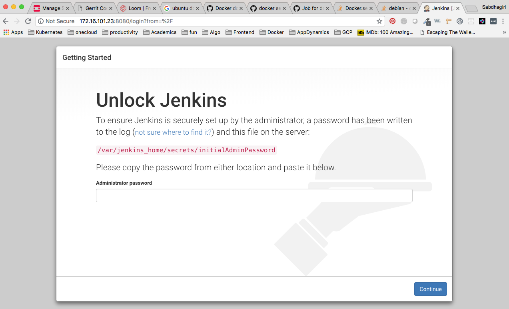

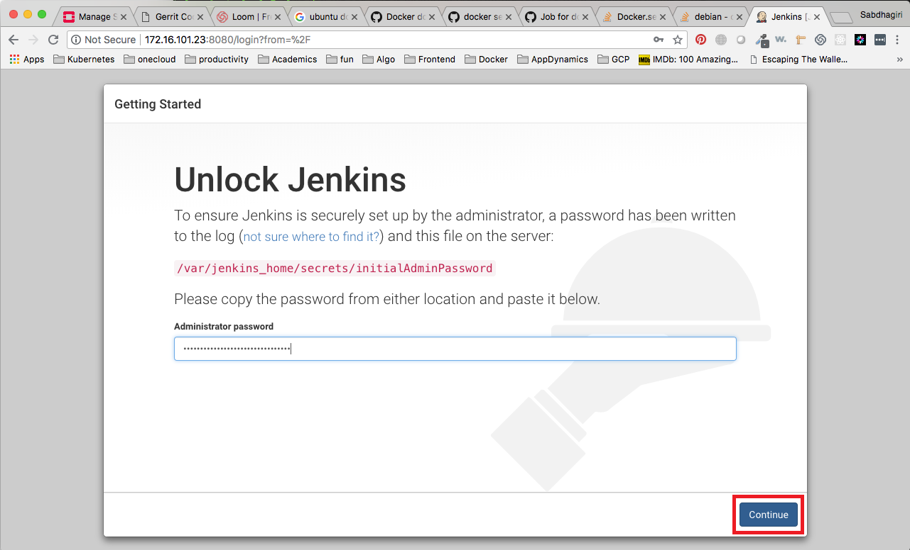

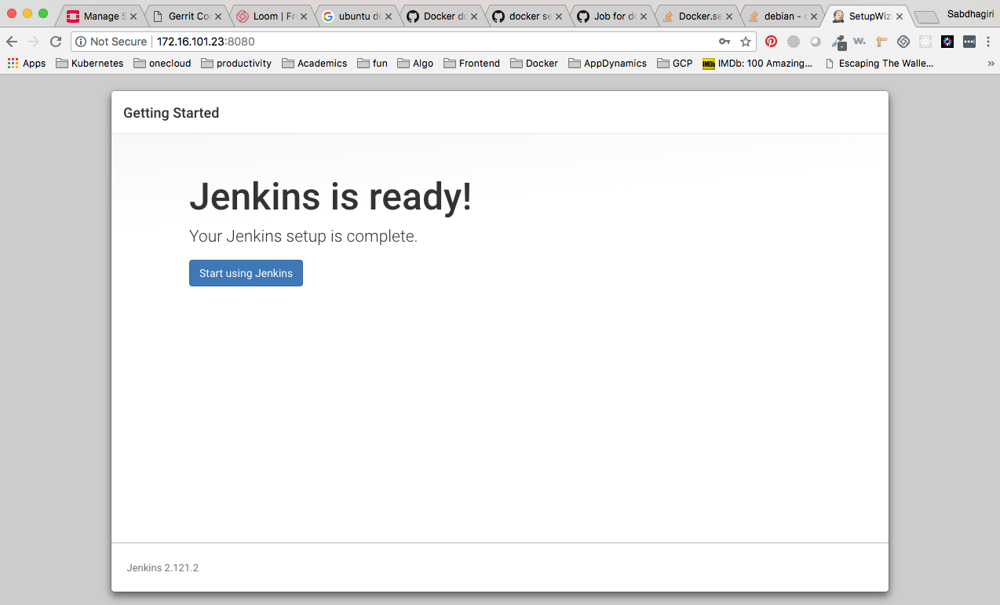

<h3>Setup gerrit and jenkins integration</h3>

>Jenkins can be extended with the help of plugins. There are a vast number of plugins available to customize jenkins according to your requirement. We want to setup integration between jenkins and gerrit in order for jenkins to be aware of events happening in gerrit. Gerrit has a way to let user listen to the event stream and the gerrit trigger plugin leverage this feature of gerrit.

<h5>Install gerrit trigger plugin in jenkins</h5>

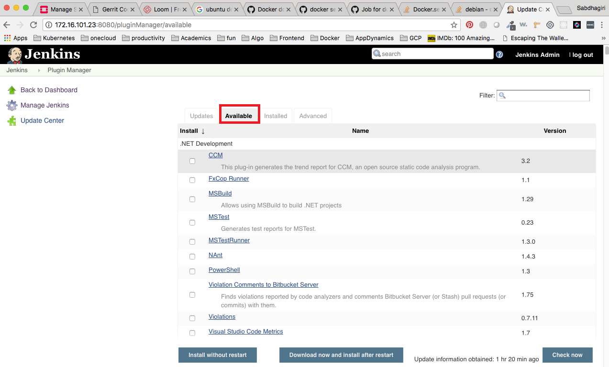

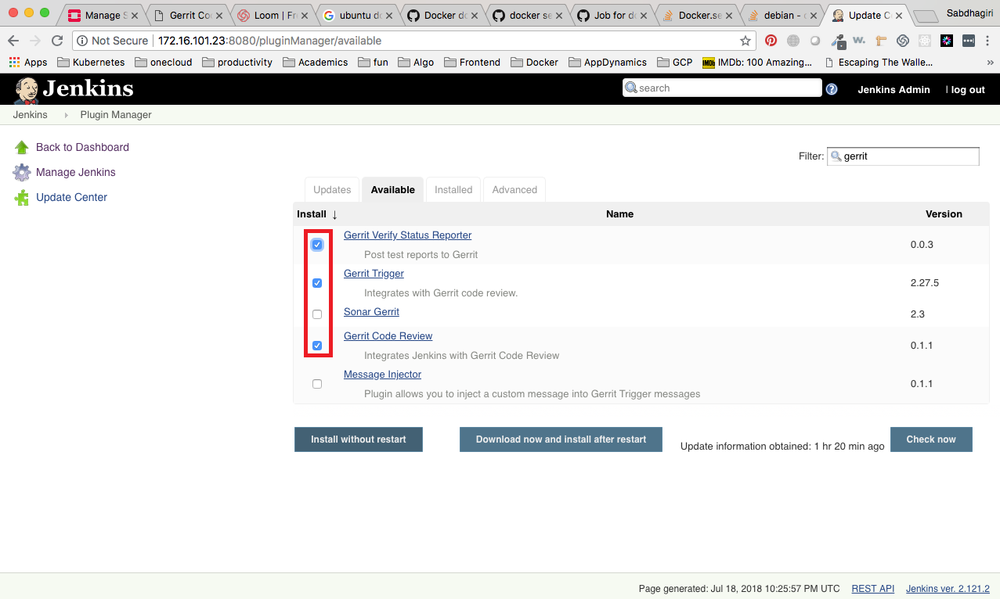

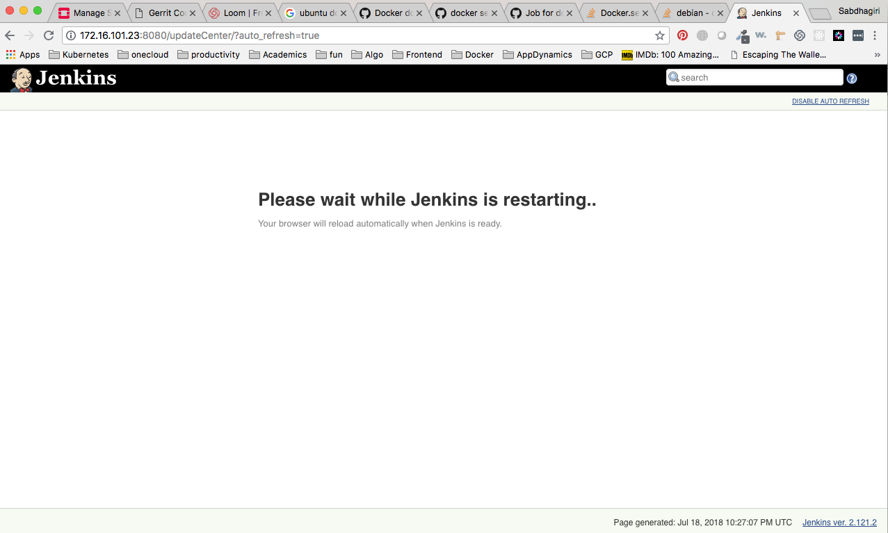

<h5>Configure gerrit trigger plugin</h5>

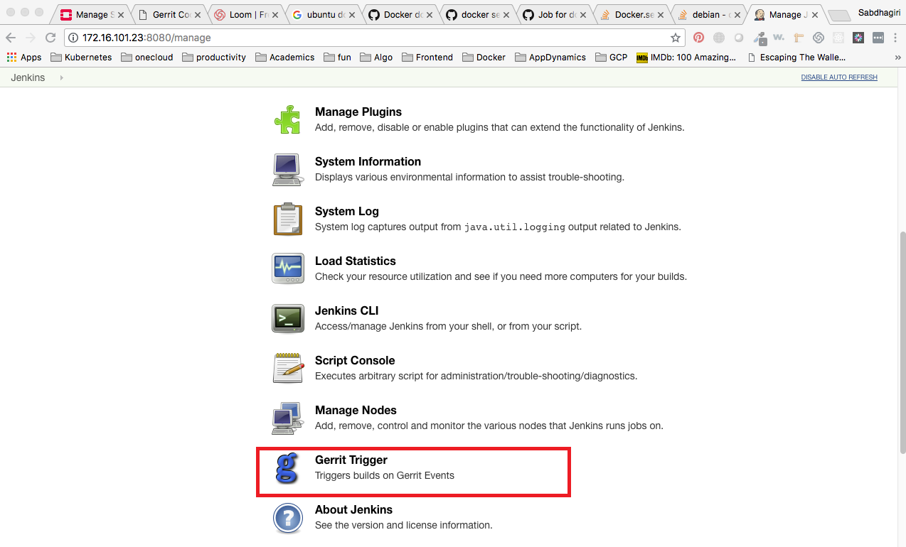

We will have to setup jenkins user to connect to gerrit in order to tap into the gerrit event stream.

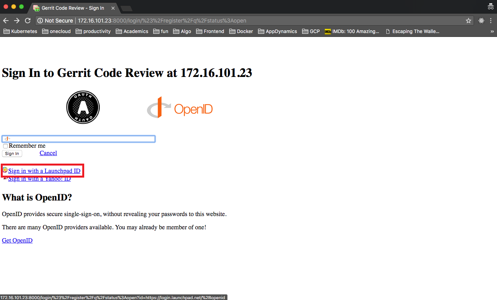

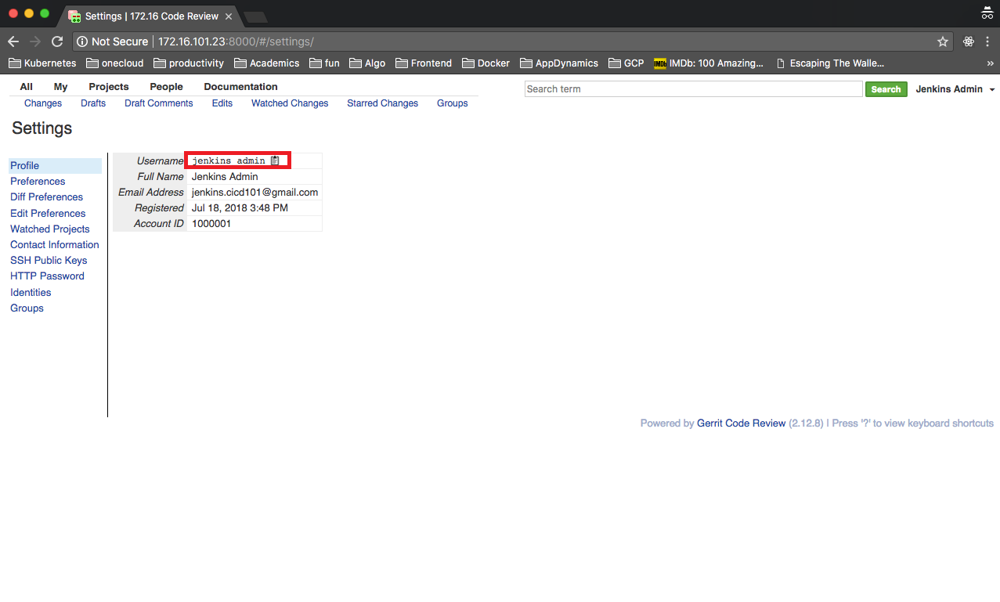

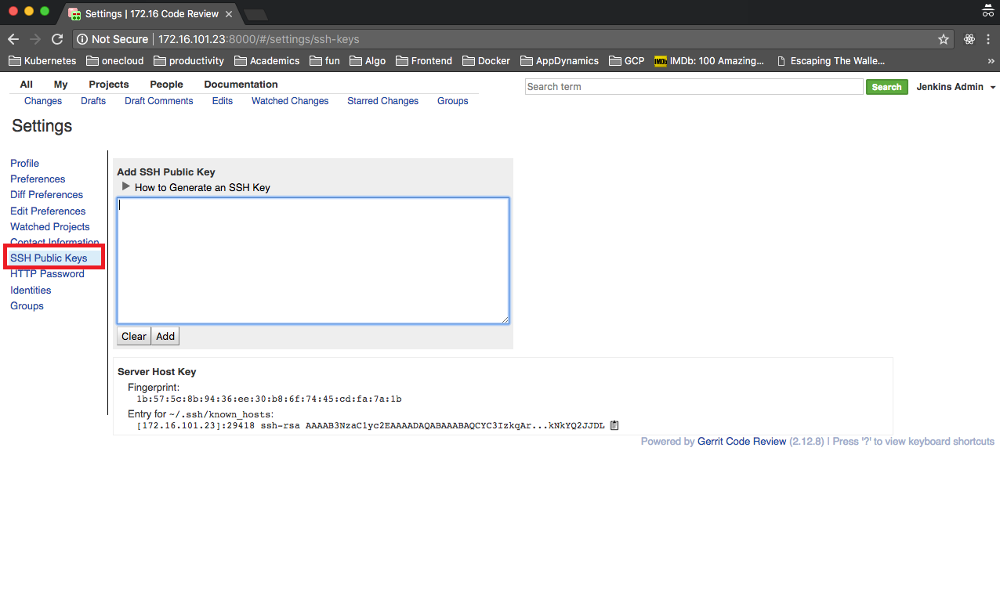

Ok, now it os time to create the ssh keys for the jenkins user, we will use the ssh identity of our jenkins user running in the jenkins container to link that account with the gerrit jenkins_admin user account. This will let jenkins connect to gerrit event stream over ssh and also pull code from gerrit and perform builds.

<h5>setup ssh keys for jenkins user</h5>

Create ssh keys for the jenkins user using ssh-keygen utility and copy the ssh public key to be added in gerrit.

~~~bash
ubuntu@cicd-lab:~$ docker exec -it jenkins bash
jenkins@5a2f3d6d9005:/$ cd
jenkins@5a2f3d6d9005:~$ ssh-keygen -t rsa -b 2048
Generating public/private rsa key pair.
Enter file in which to save the key (/var/jenkins_home/.ssh/id_rsa): 
Created directory '/var/jenkins_home/.ssh'.
Enter passphrase (empty for no passphrase): 
Enter same passphrase again: 
Your identification has been saved in /var/jenkins_home/.ssh/id_rsa.
Your public key has been saved in /var/jenkins_home/.ssh/id_rsa.pub.
The key fingerprint is:
SHA256:fIbkvARV1BN4sbWPM/RnCzFKwVzANq8TuoXV2l9bqvQ jenkins@5a2f3d6d9005
The key's randomart image is:
+---[RSA 2048]----+
|        .o*==+.  |
|       .  .*=o . |
|      . . .o=+o  |
|       * ..o.+o+ |
|        S *.=.+ =|
|       . * = ..+=|
|        . o o .o+|
|         . . ..o |
|            ..E  |
+----[SHA256]-----+
jenkins@5a2f3d6d9005:~$ cat ~/.ssh/id_rsa.pub 
ssh-rsa AAAAB3NzaC1yc2EAAAADAQABAAABAQDEobSdvr4D4D0JUwUQt0fKrK4tMaPlKoY0/Q6uHuwmhMWglWd9tIK+eF6HOe7pjaReEGZZgN6atJLEJzVgLMjLq1JQ4dVmOrMM8jtJmSA1LL3L0c4wsWuUKnoWcG6QGTlOSfQ8+ABkYNpjCQiTCBrIBeNMI3+7sSihWukrPykzzIFrozZejo6FM3At/RCxr1VlzTnbWqCtJsUyRjECMXc7cfMe0sSsU4QwiZqfb041/DODHUZrKunhKB8iUGkMj9SY4+KpJdhUCeE+US4bZmf5doBz/Cgef0qd9m2S7uEDpl+LZmTZ3UuSgG5Zg9I9nh02m1P3bktqFpJzyeVzNWb3 jenkins@5a2f3d6d9005
~~~

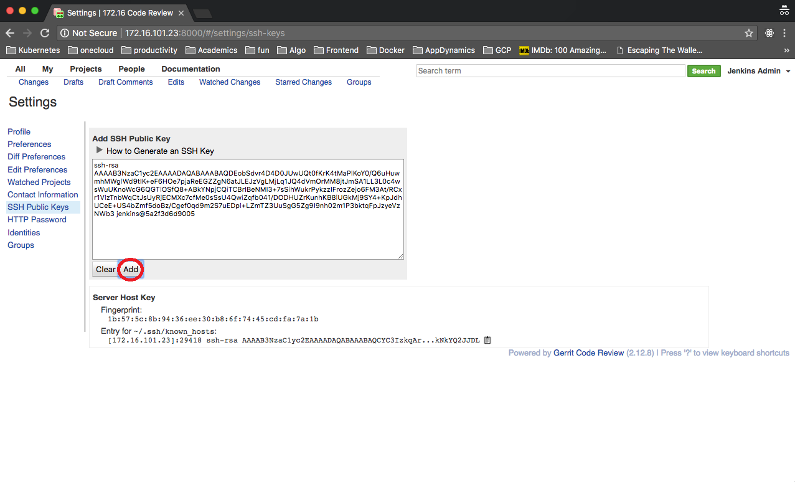

We can verify the connectivity by trying to ssh into the gerrit server on port 29418

~~~bash
jenkins@5a2f3d6d9005:~$ ssh jenkins_admin@172.16.101.23 -p 29418
Unable to negotiate with 172.16.101.23 port 29418: no matching key exchange method found. Their offer: diffie-hellman-group1-sha1
~~~

We can overcome this no matching key exchange method by including a config file for the ssh

~~~bash
jenkins@5a2f3d6d9005:~$ echo "Host 172.16.101.23
>     Hostname 172.16.101.23
>     Port 29418
>     IdentityFile ~/.ssh/id_rsa
>     KexAlgorithms +diffie-hellman-group1-sha1" > ~/.ssh/config
jenkins@5a2f3d6d9005:~$ ssh jenkins_admin@172.16.101.23 -p 29418
The authenticity of host '[172.16.101.23]:29418 ([172.16.101.23]:29418)' can't be established.
RSA key fingerprint is SHA256:t0Lv1WRf9VTdenhSR0RY/7YMOL+NNsilC/9PS0zlDlU.
Are you sure you want to continue connecting (yes/no)? yes
Warning: Permanently added '[172.16.101.23]:29418' (RSA) to the list of known hosts.

  ****    Welcome to Gerrit Code Review    ****

  Hi Jenkins Admin, you have successfully connected over SSH.

  Unfortunately, interactive shells are disabled.
  To clone a hosted Git repository, use:

  git clone ssh://jenkins_admin@172.16.101.23:29418/REPOSITORY_NAME.git

Connection to 172.16.101.23 closed.
~~~

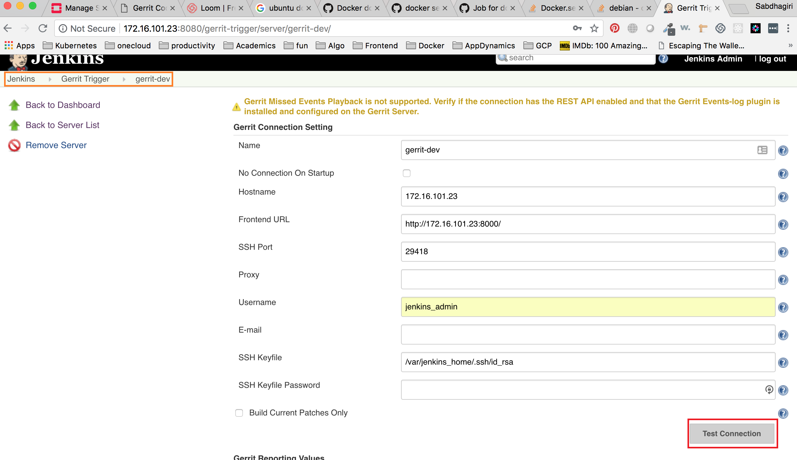

As gerrit admin user we have to add the jenkins_admin user to the Non-Interactive users group so jenkins can listen the the gerrit event stream.

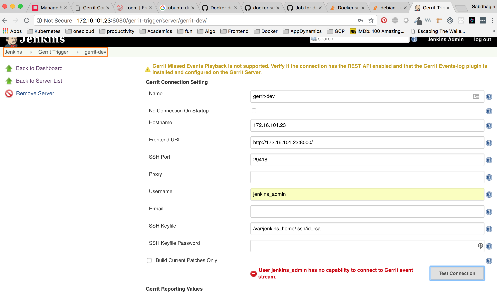

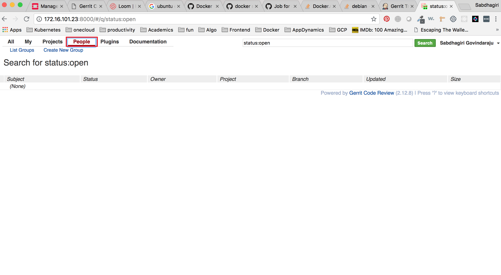

<h3>Setup the code repository</h3>

1. Login to github and search for sabdhagiri/demo-app

2. fork the repository

3. As admin user in gerrit create a new project without initial commit and the name matching that of the repository you just forked.

4. update the project access rights to allow the users of Non-Interactive users group to set Label Verified.
 
5. from the command line clone the github demo-app repository

6. Now edit your git remote of the todo-app and set it to the gerrit project url.

7. as the admin user push the code to update the project refs in gerrit to match that of the one in github.

8. update the project access rights to allow the users of Non-Interactive users group to set Label Verified.

9. Update the gerrit replication config and add github entry.    

<h3> Setup the code repository</h3>

<h5>Setup up Github account and fork the demo-app repository</h5>

You can signup for a new Github account if you don't have one already

**`TODO: Include screenshots from Mike's Lab guide content`**

Once you login to your account

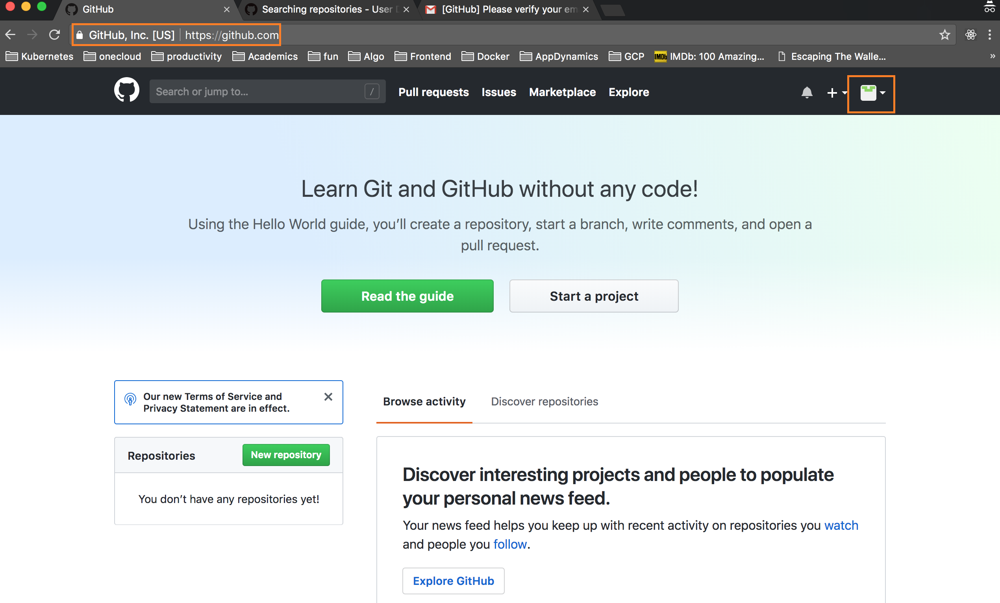

Search for sabdhagiri/demo-app in the search box

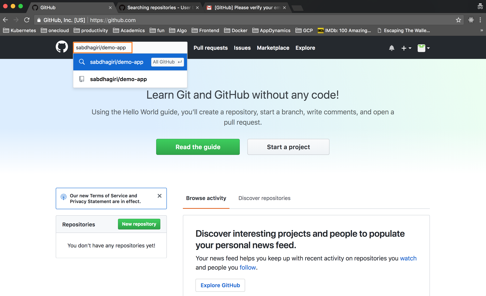

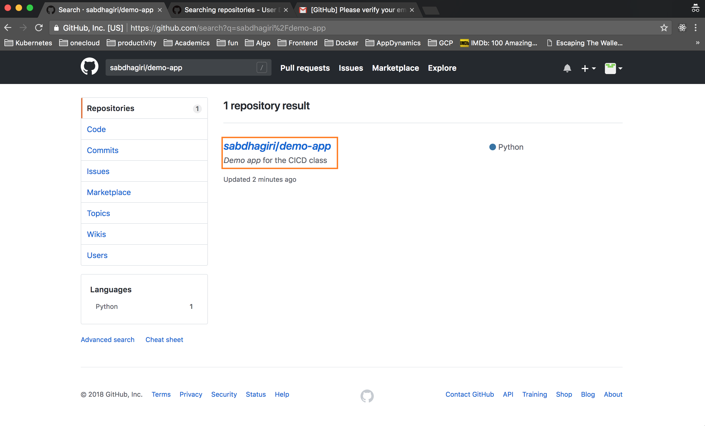

Once you find the repository, you can click on the repo to open it

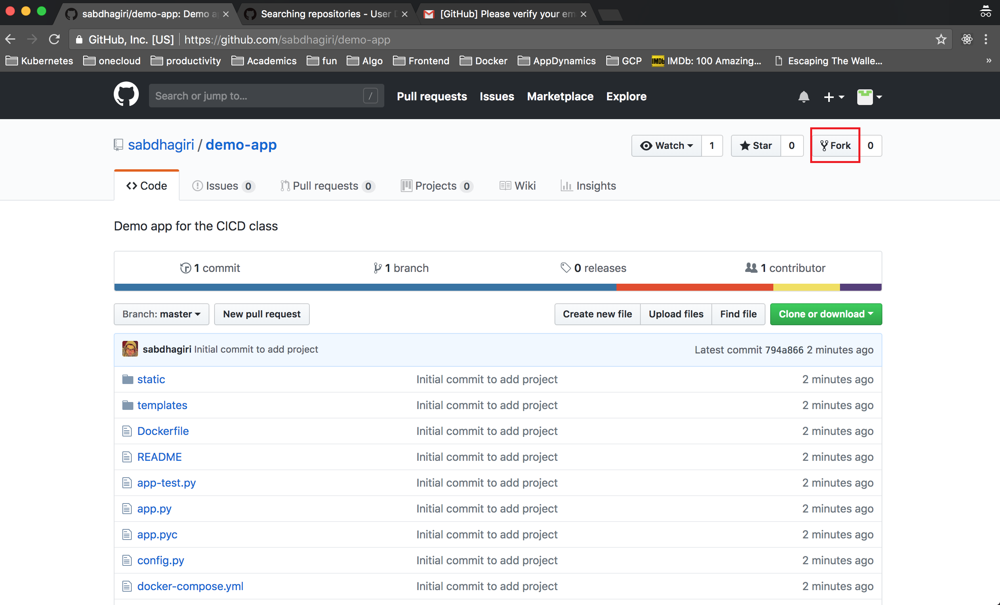

While you are on the repo page, you will see a `fork` button on the top right. Click the fork button to fork the repository on to your account. 

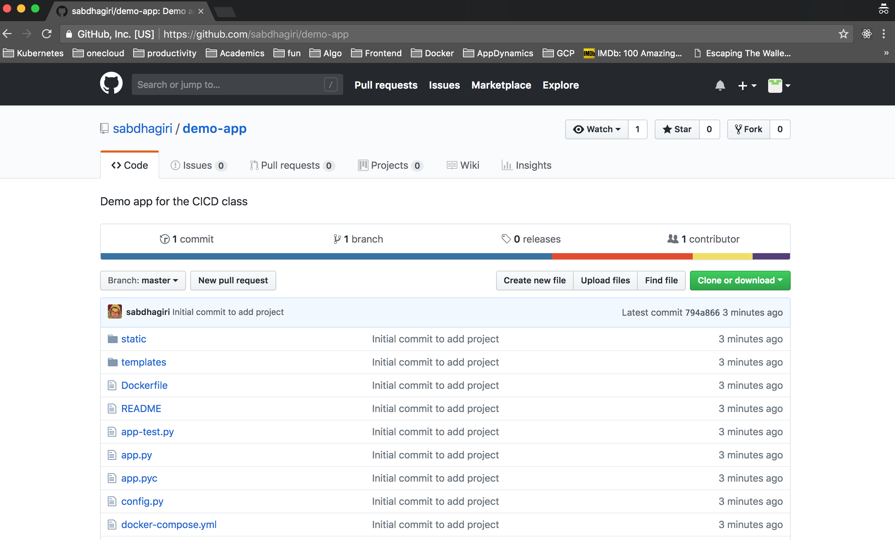

wait for the repo to be forked

<h5>Clone code onto your local development machine </h5>

Here we will use the lab instance as our development machine.

~~~bash
ubuntu@cicd-lab:~$ git clone https://github.com/sabs6488/demo-app.git
Cloning into 'demo-app'...
remote: Counting objects: 21, done.
remote: Compressing objects: 100% (20/20), done.
remote: Total 21 (delta 1), reused 21 (delta 1), pack-reused 0
Unpacking objects: 100% (21/21), done.
Checking connectivity... done.
~~~

Now let's inspect the repo we just cloned   

~~~bash
ubuntu@cicd-lab:~$ cd demo-app/
ubuntu@cicd-lab:~/demo-app$ ll
total 80
drwxrwxr-x 5 ubuntu ubuntu 4096 Jul 19 19:24 ./
drwxr-xr-x 6 ubuntu ubuntu 4096 Jul 19 19:24 ../
-rw-rw-r-- 1 ubuntu ubuntu 4461 Jul 19 19:24 app.py
-rw-rw-r-- 1 ubuntu ubuntu 5039 Jul 19 19:24 app.pyc
-rw-rw-r-- 1 ubuntu ubuntu 3586 Jul 19 19:24 app-test.py
-rw-rw-r-- 1 ubuntu ubuntu  426 Jul 19 19:24 config.py
-rw-rw-r-- 1 ubuntu ubuntu   89 Jul 19 19:24 docker-compose.yml
-rw-rw-r-- 1 ubuntu ubuntu  390 Jul 19 19:24 Dockerfile
drwxrwxr-x 8 ubuntu ubuntu 4096 Jul 19 19:24 .git/
-rw-rw-r-- 1 ubuntu ubuntu 2251 Jul 19 19:24 objectstore.py
-rw-rw-r-- 1 ubuntu ubuntu 3022 Jul 19 19:24 objectstore.pyc
-rw-rw-r-- 1 ubuntu ubuntu  257 Jul 19 19:24 README
-rw-rw-r-- 1 ubuntu ubuntu  438 Jul 19 19:24 requirements.txt
-rw-rw-r-- 1 ubuntu ubuntu  175 Jul 19 19:24 schema.sql
-rw-rw-r-- 1 ubuntu ubuntu  148 Jul 19 19:24 service.wsgi
drwxrwxr-x 2 ubuntu ubuntu 4096 Jul 19 19:24 static/
drwxrwxr-x 2 ubuntu ubuntu 4096 Jul 19 19:24 templates/
-rw-rw-r-- 1 ubuntu ubuntu  338 Jul 19 19:24 todo.conf
ubuntu@cicd-lab:~/demo-app$ git status
On branch master
Your branch is up-to-date with 'origin/master'.
nothing to commit, working directory clean
ubuntu@cicd-lab:~/demo-app$ git remote -v
origin	https://github.com/sabs6488/demo-app.git (fetch)
origin	https://github.com/sabs6488/demo-app.git (push)
ubuntu@cicd-lab:~/demo-app$ 
~~~

<h5>Create new project in gerrit for setting up the code review process</h5>

`Let's login to gerrit as admin user and create new project with the same name as that of our github project(demo-project), we will need this to setup replication in later stages.`

`Project is created in gerrit. Now, click on access tab on the top to edit access rights for groups, we need to do this enable Non-Interactive Users to set Verified Label values(This will be used by Jenkins to setup scores) follow the steps below:`

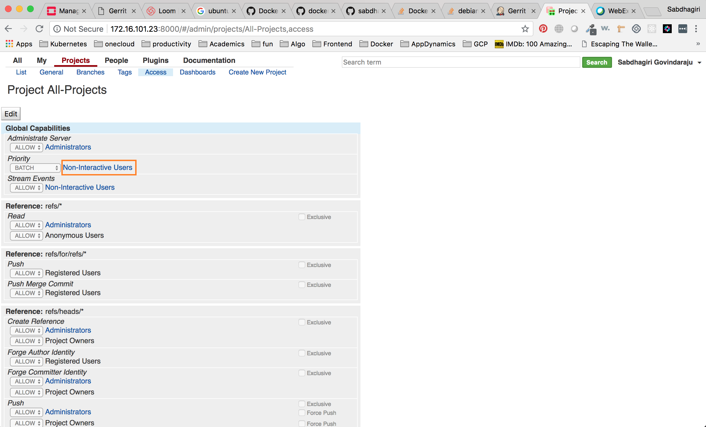

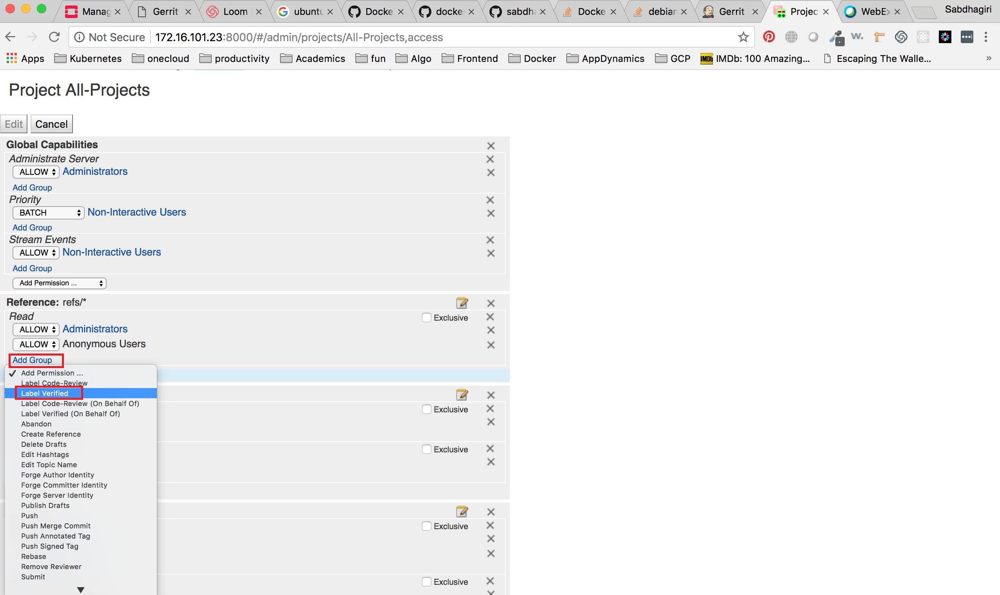

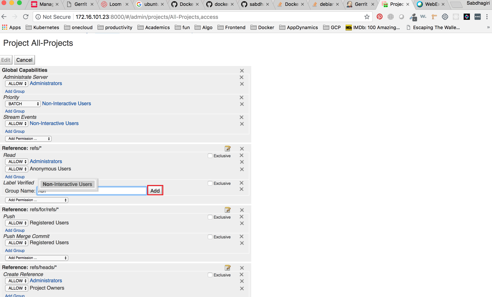

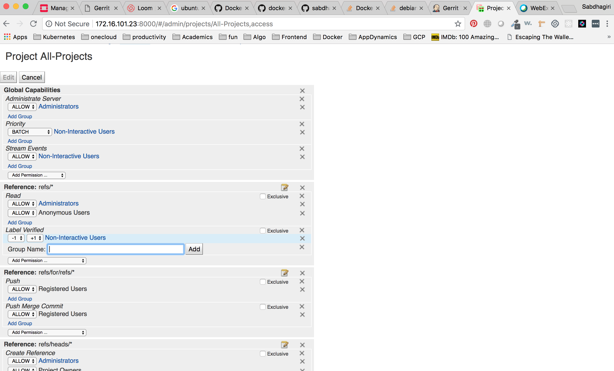

Now that we have the project created, it wouldn't have any code in it.

Let's push the code from our development instance, but in order to do so we need to setup ssh keys for our admin account.

Let's create a ssh key pair for our user.

~~~bash
ubuntu@cicd-lab:~/demo-app$ ssh-keygen
Generating public/private rsa key pair.
Enter file in which to save the key (/home/ubuntu/.ssh/id_rsa): 
Enter passphrase (empty for no passphrase): 
Enter same passphrase again: 
Your identification has been saved in /home/ubuntu/.ssh/id_rsa.
Your public key has been saved in /home/ubuntu/.ssh/id_rsa.pub.
The key fingerprint is:
SHA256:RjH1bLeAa3ByBFXW3Vpog9q0nN9hDRpkBhbsdhkuVag ubuntu@cicd-lab
The key's randomart image is:
+---[RSA 2048]----+
|        +=B=*=.o.|
|         =.BB * +|
|        +.+O=O.=.|
|       . =EoXo.+.|
|        S.oo .o..|
|       . .    . .|
|                 |
|                 |
|                 |
+----[SHA256]-----+
ubuntu@cicd-lab:~/demo-app$ cat ~/.ssh/id_rsa.pub 
ssh-rsa AAAAB3NzaC1yc2EAAAADAQABAAABAQDoNhvR6ZgTzmubC+mmp9cPWe5+7K9mcaaV1/lyTrOl0of1PZJMD8Jor7+Y3kaMyCRROUmzeQm5Dnr2PH6O69/apx4TwvDbWxhKhVvPNFpWWL6DY/to0yda3BY+Xpa/eDMaa1Iy+bRKwDRlRSmJvcVJCO4N/58UVlP235OWhGUhng/tGNMuyXPcecWJgSe1xBLnyi2MQ1aUBdNO/CsCihMVJP9oKJQxNJP9CNxs7mKxW3pwgeNbF7xcgVzTCjIW8A6a0ukOSbUbiZ+YRvWdjxz3nEatw1fhqiAvPkjuliw5gC0SwVXmJcFBlJciR1fdWpyynaNynoKN03fQjYPr3Vyt ubuntu@cicd-lab
ubuntu@cicd-lab:~/demo-app$
~~~

copy the public key and add it to the admin account of gerrit. login to gerrit as admin user and do the following:

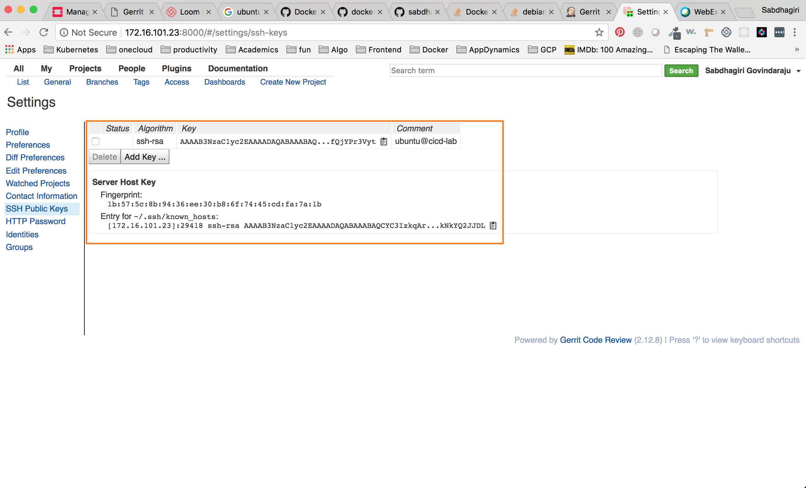

Now try to ssh from the development vm to gerrit on port 29418 with username as the admin user account.

~~~bash
ubuntu@cicd-lab:~/demo-app$ ssh sabdhagiri@172.16.101.23 -p 29418
Unable to negotiate with 172.16.101.23 port 29418: no matching key exchange method found. Their offer: diffie-hellman-group1-sha1
~~~

We will have to edit the ssh config file to include the Key exchange method config

create a new file called config at the following location 

~~~bash
ubuntu@cicd-lab:~/demo-app$ vim ~/.ssh/config
~~~

and copy the following lines into it and save it

~~~bash
Host 172.16.101.23
    Hostname 172.16.101.23
    Port 29418
    IdentityFile ~/.ssh/id_rsa
    KexAlgorithms +diffie-hellman-group1-sha1
~~~

Now, ssh to gerrit should work just fine

~~~bash
ubuntu@cicd-lab:~/demo-app$ ssh sabdhagiri@172.16.101.23 -p 29418
The authenticity of host '[172.16.101.23]:29418 ([172.16.101.23]:29418)' can't be established.
RSA key fingerprint is SHA256:t0Lv1WRf9VTdenhSR0RY/7YMOL+NNsilC/9PS0zlDlU.
Are you sure you want to continue connecting (yes/no)? yes
Warning: Permanently added '[172.16.101.23]:29418' (RSA) to the list of known hosts.

  ****    Welcome to Gerrit Code Review    ****

  Hi Sabdhagiri Govindaraju, you have successfully connected over SSH.

  Unfortunately, interactive shells are disabled.
  To clone a hosted Git repository, use:

  git clone ssh://sabdhagiri@172.16.101.23:29418/REPOSITORY_NAME.git

Connection to 172.16.101.23 closed.
ubuntu@cicd-lab:~/demo-app$ 
~~~

Now, let's get the remote of the demo-app repo we created and push this code from local development tree to the gerrit remote.

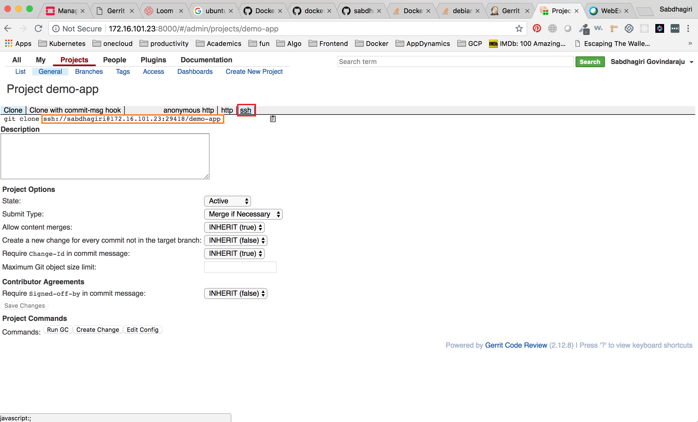

grab the ssh url from the project general info and update the local development tree git remote as follows:

~~~bash
ubuntu@cicd-lab:~/demo-app$ git remote -v
origin	https://github.com/sabs6488/demo-app.git (fetch)
origin	https://github.com/sabs6488/demo-app.git (push)
ubuntu@cicd-lab:~/demo-app$ git remote set-url origin ssh://sabdhagiri@172.16.101.23:29418/demo-app
ubuntu@cicd-lab:~/demo-app$ git remote -v
origin	ssh://sabdhagiri@172.16.101.23:29418/demo-app (fetch)
origin	ssh://sabdhagiri@172.16.101.23:29418/demo-app (push)
ubuntu@cicd-lab:~/demo-app$ 
~~~