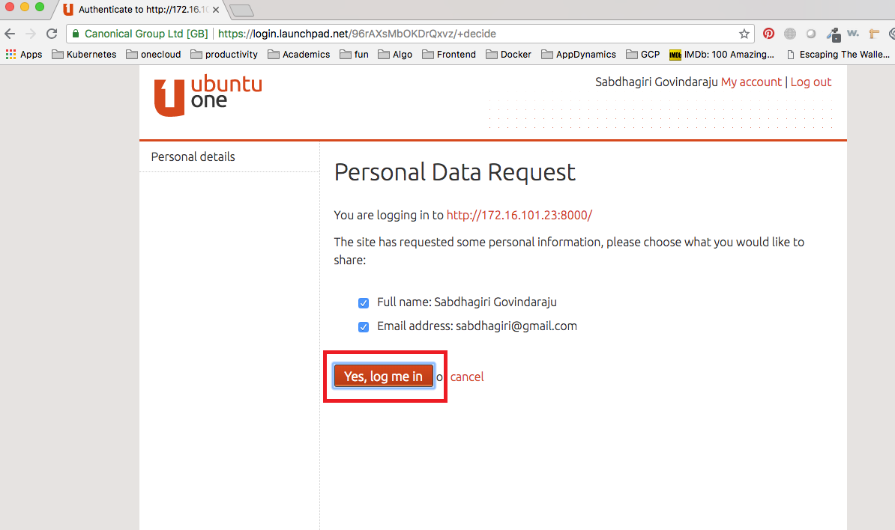
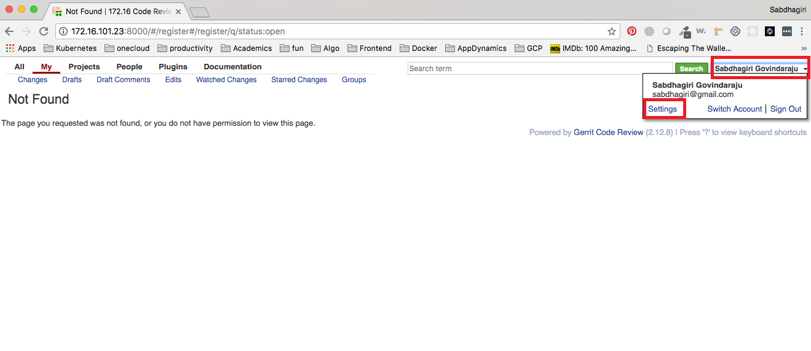

<h1>CI/CD Lab</h1>

<h2>Table of contents</h2>

1. **[Setup gerrit](#Setup-gerrit)**
2. **Setup docker runtime**
3. **Setup jenkins**
4. **Setup gerrit/jenkins integration**
5. **Setup CI job to verify the patchset**
6. **Setup CD job to build and publish docker image**
7. **Setup CD job to deploy the services**

<h3>Setup gerrit</h3>

<h5>update systemand install pre-requisites</h5>

~~~bash
ubuntu@cicd-lab:~$ sudo apt-get -y update
ubuntu@cicd-lab:~$ sudo apt-get install git default-jdk wget -y
~~~

<h5>create gerrit user</h5>

~~~bash
ubuntu@cicd-lab:~$ sudo useradd -m gerrit

ubuntu@cicd-lab:~$ sudo su gerrit

gerrit@cicd-lab:/home/ubuntu$ cd

gerrit@cicd-lab:~$ pwd
/home/gerrit

~~~

<h5>download gerrit war file and verify java install</h5>

~~~bash
gerrit@cicd-lab:~$ wget https://www.gerritcodereview.com/download/gerrit-2.12.8.war -O gerrit.war

gerrit@cicd-lab:~$ java -version
openjdk version "1.8.0_171"
OpenJDK Runtime Environment (build 1.8.0_171-8u171-b11-0ubuntu0.16.04.1-b11)
OpenJDK 64-Bit Server VM (build 25.171-b11, mixed mode)
~~~

<h5>Initialize gerrit code review site</h5>

~~~bash
gerrit@cicd-lab:~$ java -jar gerrit.war init -d review_site

*** Gerrit Code Review 2.12.8
*** 

Create '/home/gerrit/review_site' [Y/n]? Y

*** Git Repositories
*** 

Location of Git repositories   [git]:

*** SQL Database
*** 

Database server type           [h2]: 

*** Index
*** 

Type                           [LUCENE/?]:

*** User Authentication
*** 

Authentication method          [OPENID/?]: 
Enable signed push support     [y/N]?

*** Review Labels
*** 

Install Verified label         [y/N]? y

*** Email Delivery
*** 

SMTP server hostname           [localhost]: 
SMTP server port               [(default)]: 
SMTP encryption                [NONE/?]: 
SMTP username                  : 

*** Container Process
*** 

Run as                         [gerrit]: 
Java runtime                   [/usr/lib/jvm/java-8-openjdk-amd64/jre]: 
Copy gerrit.war to review_site/bin/gerrit.war [Y/n]? 
Copying gerrit.war to review_site/bin/gerrit.war

*** SSH Daemon
*** 

Listen on address              [*]: 
Listen on port                 [29418]: 

Gerrit Code Review is not shipped with Bouncy Castle Crypto SSL v152
  If available, Gerrit can take advantage of features
  in the library, but will also function without it.
Download and install it now [Y/n]? n
Generating SSH host key ... rsa(simple)... done

*** HTTP Daemon
*** 

Behind reverse proxy           [y/N]? 
Use SSL (https://)             [y/N]? 
Listen on address              [*]: 
Listen on port                 [8080]: 
Canonical URL                  [http://localhost:8080/]: http://172.16.101.23:8080/

*** Plugins
*** 

Installing plugins.
Install plugin reviewnotes version v2.12.8 [y/N]? y
Install plugin replication version v2.12.8 [y/N]? y
Install plugin commit-message-length-validator version v2.12.8 [y/N]? y
Install plugin download-commands version v2.12.8 [y/N]? y
Install plugin singleusergroup version v2.12.8 [y/N]? y
Initializing plugins.
No plugins found with init steps.

Initialized /home/gerrit/review_site
Executing /home/gerrit/review_site/bin/gerrit.sh start
Starting Gerrit Code Review: OK
Waiting for server on 172.16.101.23:8080 ... OK
Opening http://172.16.101.23:8080/#/admin/projects/ ...FAILED
Open Gerrit with a JavaScript capable browser:
  http://172.16.101.23:8080/#/admin/projects/

~~~

<h5>Register initial admin user</h5>

<h3>Setup docker runtime - Lab II</h3>

<h5>Install pre-requisites</h5>

~~~bash
ubuntu@cicd-lab:~$ sudo apt-get install \
    apt-transport-https \
    ca-certificates \
    curl \
    software-properties-common
~~~

<h5>add docker apt repository</h5>

~~~bash
ubuntu@cicd-lab:~$ curl -fsSL https://download.docker.com/linux/ubuntu/gpg | sudo apt-key add -
OK

ubuntu@cicd-lab:~$ sudo apt-key fingerprint 0EBFCD88
pub   4096R/0EBFCD88 2017-02-22
      Key fingerprint = 9DC8 5822 9FC7 DD38 854A  E2D8 8D81 803C 0EBF CD88
uid                  Docker Release (CE deb) <docker@docker.com>
sub   4096R/F273FCD8 2017-02-22

ubuntu@cicd-lab:~$ sudo add-apt-repository \
   "deb [arch=amd64] https://download.docker.com/linux/ubuntu \
   $(lsb_release -cs) \
   stable”

~~~

<h5>Install docker-ce</h5>

~~~bash
ubuntu@cicd-lab:~$ sudo apt-get update

ubuntu@cicd-lab:~$ sudo apt-get install docker-ce

ubuntu@cicd-lab:~$ sudo systemctl status docker.service
● docker.service - Docker Application Container Engine
   Loaded: loaded (/lib/systemd/system/docker.service; enabled; vendor preset: enabled)
   Active: active (running) since Wed 2018-07-18 06:15:45 UTC; 38s ago

~~~

<h5>Add user to docker group to enable access</h5>

~~~bash
ubuntu@cicd-lab:~$ sudo usermod -aG docker ubuntu
~~~

<h5>Secure the docker daemon with TLS to enable remote access</h5>

**Create directories to hold the certificates**

~~~bash
ubuntu@cicd-lab:~$ sudo mkdir /etc/docker/ssl
ubuntu@cicd-lab:~$ mkdir -p ~/.docker
~~~

**CREATE AND SIGN CA key and certificate**

~~~bash
ubuntu@cicd-lab:~$ openssl genrsa -out ~/.docker/ca-key.pem 2048

ubuntu@cicd-lab:~$ openssl req -x509 -new -nodes -key ~/.docker/ca-key.pem \
    -days 10000 -out ~/.docker/ca.pem -subj '/CN=docker-CA'

ubuntu@cicd-lab:~$ ls ~/.docker/
ca-key.pem  ca.pem

ubuntu@cicd-lab:~$ sudo cp ~/.docker/ca.pem /etc/docker/ssl
~~~

**Create openssl config for client certificate**

~~~bash
ubuntu@cicd-lab:~$ vim ~/.docker/openssl.cnf
~~~

and copy the following content into that and save the file

~~~bash
[req]
req_extensions = v3_req
distinguished_name = req_distinguished_name
[req_distinguished_name]
[ v3_req ]
basicConstraints = CA:FALSE
keyUsage = nonRepudiation, digitalSignature, keyEncipherment
extendedKeyUsage = serverAuth, clientAuth
~~~

**Create openssl config for server certificate**

~~~bash
ubuntu@cicd-lab:~$ sudo vim /etc/docker/ssl/openssl.cnf
~~~

and copy the following content into that and save the file

~~~bash
[req]
req_extensions = v3_req
distinguished_name = req_distinguished_name
[req_distinguished_name]
[ v3_req ]
basicConstraints = CA:FALSE
keyUsage = nonRepudiation, digitalSignature, keyEncipherment
extendedKeyUsage = serverAuth, clientAuth
subjectAltName = @alt_names

[alt_names]
DNS.1 = cicd-lab.nova.local
IP.1 = 172.16.101.23
IP.2 = 127.0.0.1
~~~

*`make sure the IP.1 is the ip of your vm`*

**Create and sign client certificate**

~~~bash
ubuntu@cicd-lab:~$ openssl genrsa -out ~/.docker/key.pem 2048

ubuntu@cicd-lab:~$ openssl req -new -key ~/.docker/key.pem -out ~/.docker/cert.csr \
    -subj '/CN=docker-client' -config ~/.docker/openssl.cnf

ubuntu@cicd-lab:~$ openssl x509 -req -in ~/.docker/cert.csr -CA ~/.docker/ca.pem \
    -CAkey ~/.docker/ca-key.pem -CAcreateserial \
    -out ~/.docker/cert.pem -days 365 -extensions v3_req \
    -extfile ~/.docker/openssl.cnf
~~~

**Create and sign server certificate**

~~~bash
ubuntu@cicd-lab:~$ sudo openssl genrsa -out /etc/docker/ssl/key.pem 2048

ubuntu@cicd-lab:~$ sudo openssl req -new -key /etc/docker/ssl/key.pem \
    -out /etc/docker/ssl/cert.csr \
    -subj '/CN=docker-server' -config /etc/docker/ssl/openssl.cnf

ubuntu@cicd-lab:~$ sudo openssl x509 -req -in /etc/docker/ssl/cert.csr -CA ~/.docker/ca.pem \
    -CAkey ~/.docker/ca-key.pem -CAcreateserial \
    -out /etc/docker/ssl/cert.pem -days 365 -extensions v3_req \
    -extfile /etc/docker/ssl/openssl.cnf
~~~

**Create docker daemon config and update docker systemd unit file**

~~~bash
ubuntu@cicd-lab:~$ sudo vim /etc/docker/daemon.json
~~~

and copy the following content into that and save the file

~~~bash
{
        "tls": true,
        "tlsverify": true,
        "tlscacert": "/etc/docker/ssl/ca.pem",
        "tlscert": "/etc/docker/ssl/cert.pem",
        "tlskey": "/etc/docker/ssl/key.pem"
}
~~~

Edit the docker systemd unit file to update the host entry

~~~bash
ubuntu@cicd-lab:~$ sudo vim /lib/systemd/system/docker.service
~~~

and edit the ExecStart value under the service section to look as following:

~~~bash
ExecStart=/usr/bin/dockerd -H unix:///var/run/docker.sock -H tcp://0.0.0.0:2376
~~~

reload the docker daemon and restart the docker service as follows:

~~~bash
ubuntu@cicd-lab:~$ sudo systemctl daemon-reload
ubuntu@cicd-lab:~$ sudo service docker stop
ubuntu@cicd-lab:~$ sudo service docker start
~~~

